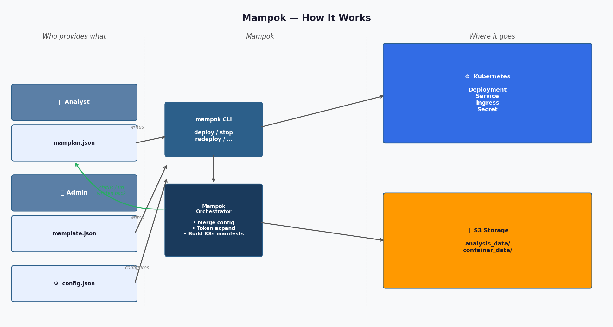
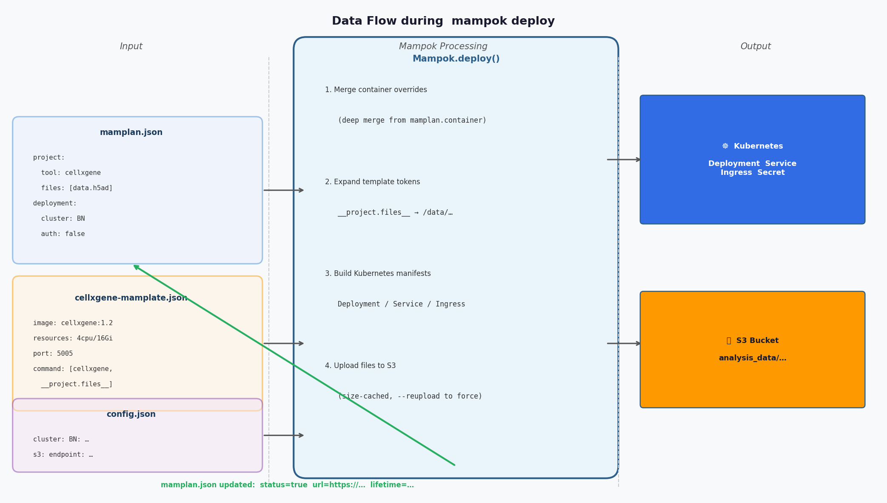

Concepts
========

This page explains the three core building blocks of Mampok and how they work
together.

   Overview of who creates what and where it ends up.

The Three Building Blocks
-------------------------

.. list-table::
   :header-rows: 1
   :widths: 15 15 30 20

   * - Object
     - Created by
     - What it describes
     - Where it lives
   * - **Mamplan**
     - Analyst / end user
     - One project: which tool, which data files, which cluster, who owns it, when it expires
     - User-specified path (passed as argument to each command)
   * - **Mamplate**
     - Admin
     - Reusable container blueprint: image, resources, port, startup command, S3 sync behavior
     - ``mamplates_path/`` (from config)
   * - **config.json**
     - Admin
     - Cluster profiles, S3 credentials, default lifetime
     - User-specified path (passed via ``--config``)

Mamplan
-------

A **Mamplan** (Mampok Project Plan) is a JSON file that describes one
specific project deployment. It is the central artifact that an analyst
creates and maintains.

Key characteristics:

* Named ``{project_id}-mamplan.json`` (all lowercase, hyphens only — no
  underscores, no uppercase)
* Stored in any directory — the path is passed as an argument to each command
* **Mutable** — Mampok writes ``deployment.status``, ``deployment.url``,
  ``deployment.lifetime``, and ``project.project_size`` back into the file
  after each operation

A Mamplan has up to five JSON sections:

.. list-table::
   :header-rows: 1
   :widths: 15 12 50

   * - Section
     - Required
     - Purpose
   * - ``project``
     - yes
     - Tool name, data files, project ID, creation date
   * - ``deployment``
     - yes
     - Target cluster, S3 bucket, expiry date, URL, auth flag
   * - ``service``
     - yes
     - Owner, analyst, organization, datatype, user access list
   * - ``container``
     - no
     - Overrides for the main or init container defined in the Mamplate
   * - ``tags``
     - no
     - Free-form metadata (e.g. ``gse``, ``pubmedid``)

See :doc:`mamplans` for the complete field reference and examples.

Mamplate
--------

A **Mamplate** (Mampok Template) is a JSON file that describes a reusable
container blueprint for a specific tool. Admins write Mamplates once; end
users reference them by the ``tool`` name in their Mamplan.

Key characteristics:

* Named ``{tool}-mamplate.json`` (e.g. ``cellxgene-mamplate.json``)
* Stored in the ``mamplates_path`` directory defined in your config
* **Immutable at deploy time** — users do not edit Mamplates directly; they
  use the optional ``container`` section in their Mamplan to override fields

A Mamplate describes:

* The **Docker image** and pull policy
* **Resource requests and limits** (CPU, memory)
* **Port** that the container listens on
* **Startup command and arguments** (with template token substitution)
* Optional **S3 data persistence** (``container_data`` or ``bucket_overwrite``)
* **Readiness probe** (HTTP or TCP)

See :doc:`mamplates` for the complete field reference.

config.json
-----------

The **config file** is the shared configuration for all of a user's Mampok
operations. It is not project-specific. Its path has no default and must be
passed explicitly to every command via ``--config``.

It contains:

* One or more **named cluster profiles** (host, namespace, kubeconfig path)
* **S3 credentials** (endpoint URL, access key, secret key, bucket prefix)
* Optional **auth proxy configuration** (needed for auth-protected deployments)
* Default **lifetime in days** applied to new deployments
* Path to the **Mamplates directory**

See :doc:`configuration` for the complete field reference.

How They Connect at Deploy Time
---------------------------------

   Data flow during a ``mampok deploy`` call.

When you run ``mampok deploy my-project-mamplan.json``:

1. Mampok reads the Mamplan and looks up the cluster name in the config.
2. It finds the matching Mamplate file using ``project.tool``.
3. The optional ``container`` section in the Mamplan is **deep-merged** on top
   of the Mamplate's container definition. Dict fields are merged recursively;
   list fields are replaced entirely by the Mamplan value.

   Example: if the Mamplate defines ``resources.requests.cpu: "500m"`` and the
   Mamplan overrides only ``resources.requests.memory: "4Gi"``, the result keeps
   both — ``cpu`` from the Mamplate, ``memory`` from the Mamplan. If the Mamplate
   defines ``args: ["--host=0.0.0.0"]`` and the Mamplan sets
   ``args: ["--host=0.0.0.0", "--dark-mode"]``, the Mamplate's list is discarded
   entirely and the Mamplan's list is used.
4. **Template tokens** of the form ``__section.key__`` in the Mamplate's
   ``command``, ``args``, and ``env`` fields are expanded using values from
   the Mamplan. For example, ``__project.files__`` becomes the comma-joined
   list of file paths from ``project.files``.
5. Mampok builds Kubernetes manifests (Deployment, Service, Ingress, Secrets)
   and applies them to the cluster.
6. After successful deployment, ``deployment.status``, ``deployment.url``, and
   ``deployment.lifetime`` are written back into the Mamplan JSON file on disk.

Project Lifecycle
-----------------

A project follows this state machine:

.. code-block:: text

    create-mamplan
          │
          ▼
    [Mamplan exists, status=false]
          │
          │  mampok deploy
          ▼
    [Running: status=true, K8s resources exist, S3 data exists]
          │         │
          │         │  mampok redeploy  (stop + deploy on a running project)
          │         ▼
          │    [Running again]
          │
          │  mampok stop
          ▼
    [Stopped: status=false, K8s resources deleted, S3 data preserved]
          │
          │  mampok deploy
          ▼
    [Running again]

The ``deployment.lifetime`` field records the expiry date. Mampok uses this
field for ``stop-expired`` (batch stop of overdue projects) and
``list-expiring`` (monitoring alert).

SHMamplan (Software Hub Mode)
------------------------------

A **SHMamplan** (Software Hub Mamplan) is a lightweight variant of the
Mamplan format. It uses a simplified schema without the analyst, datatype,
organization, and user metadata fields. Authentication is always enabled and
cannot be changed by the user.

SHMamplan files are named ``{project_id}-shmamplan.json`` and are loaded
automatically alongside regular Mamplans when scanning a repository directory.

See :ref:`shmamplan` in the Advanced section for details.
