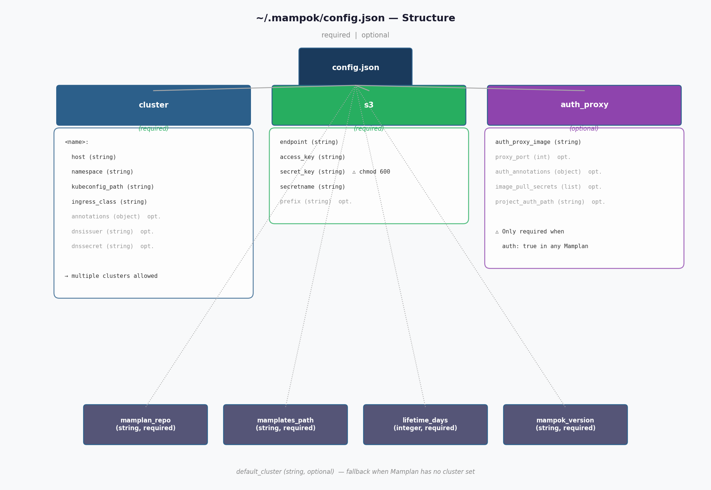

Configuration
=============

Mampok reads its configuration from a JSON file. The default location is
``~/.mampok/config.json``. You can override it for any command with the
``--config PATH`` option.

   Structure of the config.json file.

Minimal Example
---------------

.. code-block:: json

    {
      "cluster": {
        "BN": {
          "host": "ingress.example.com",
          "namespace": "mampok",
          "kubeconfig_path": "/home/user/.kube/bn-config"
        }
      },
      "s3": {
        "endpoint": "https://s3.example.com",
        "access_key": "my-access-key",
        "secret_key": "my-secret-key",
        "secretname": "s3-credentials",
        "prefix": "mampok"
      },
      "mamplan_repo": "/home/user/mamplans",
      "mamplates_path": "/home/user/mamplates",
      "lifetime_days": 30,
      "mampok_version": ">=2.0.0,<3.0.0"
    }

File Location
-------------

The default path is ``~/.mampok/config.json``. Override it for any command::

    mampok deploy ~/mamplans/ --config /path/to/other-config.json

Field Reference
---------------

Top-level fields
~~~~~~~~~~~~~~~~

.. list-table::
   :header-rows: 1
   :widths: 22 10 10 45

   * - Field
     - Type
     - Required
     - Description
   * - ``mamplan_repo``
     - string
     - yes
     - Path to the Mamplan repository directory. Used by ``stop-expired``,
       ``check-status``, and ``list-expiring``.
   * - ``mamplates_path``
     - string
     - yes
     - Path to the directory containing ``*-mamplate.json`` files.
   * - ``lifetime_days``
     - integer
     - yes
     - Default deployment lifetime in days. Written to
       ``deployment.lifetime`` at deploy time as ``now + lifetime_days``.
   * - ``mampok_version``
     - string
     - yes
     - `PEP 440 version specifier
       <https://peps.python.org/pep-0440/#version-specifiers>`_ for the
       required Mampok version (e.g. ``">=2.0.0,<3.0.0"``). Mampok checks
       this on startup and raises an error if the installed version does not
       match. See :ref:`version-pinning`.
   * - ``default_cluster``
     - string
     - no
     - Fallback cluster name when a Mamplan does not specify one. Primarily
       useful for the Python API (``create_sh_mamplan``).

``cluster`` section
~~~~~~~~~~~~~~~~~~~

The ``cluster`` key contains a dictionary of named cluster profiles. You can
have as many as you need. The key (e.g. ``"BN"``) must match the
``deployment.cluster`` field in your Mamplans.

.. code-block:: json

    "cluster": {
      "BN": {
        "host": "ingress.bn.example.com",
        "namespace": "mampok",
        "kubeconfig_path": "/home/user/.kube/bn-config",
        "ingress_class": "nginx"
      },
      "BN_public": {
        "host": "ingress.public.example.com",
        "namespace": "mampok-public",
        "kubeconfig_path": "/home/user/.kube/bn-public-config",
        "ingress_class": "nginx"
      }
    }

.. list-table::
   :header-rows: 1
   :widths: 22 10 10 45

   * - Field
     - Type
     - Required
     - Description
   * - ``host``
     - string
     - yes
     - Ingress host domain for this cluster (e.g.
       ``"ingress.example.com"``). Used to construct deployment URLs.
   * - ``namespace``
     - string
     - yes
     - Kubernetes namespace where resources are created.
   * - ``kubeconfig_path``
     - string
     - yes
     - Absolute path to the kubeconfig file for this cluster.
   * - ``ingress_class``
     - string
     - no
     - Kubernetes Ingress class name (e.g. ``"nginx"``).
   * - ``annotations``
     - object
     - no
     - Extra Ingress annotations applied to every deployment on this cluster.
   * - ``dnsissuer``
     - string
     - no
     - cert-manager issuer name for TLS certificate generation.
   * - ``dnssecret``
     - string
     - no
     - DNS secret name for ACME challenge.

``s3`` section
~~~~~~~~~~~~~~

.. list-table::
   :header-rows: 1
   :widths: 22 10 10 45

   * - Field
     - Type
     - Required
     - Description
   * - ``endpoint``
     - string
     - yes
     - S3-compatible endpoint URL (e.g. ``"https://s3.example.com"``).
       Works with AWS S3, MinIO, Ceph, and other S3-compatible stores.
   * - ``access_key``
     - string
     - yes
     - S3 access key ID.
   * - ``secret_key``
     - string
     - yes
     - S3 secret access key. See security note below.
   * - ``secretname``
     - string
     - yes
     - Name of the Kubernetes Secret that holds the S3 credentials. This
       secret must exist in the cluster namespace before deploying.
   * - ``prefix``
     - string
     - no
     - Prefix prepended to auto-generated bucket names:
       ``{prefix}-{project_id}-{tool}``. Can be empty.

.. warning::

   ``secret_key`` is stored in plain text in the config file. Protect it
   with restrictive file permissions::

       chmod 600 ~/.mampok/config.json

``auth_proxy`` section (optional)
~~~~~~~~~~~~~~~~~~~~~~~~~~~~~~~~~~

The ``auth_proxy`` section is required only if you deploy projects with
``deployment.auth: true``. It configures the Gatekeeper sidecar container
that handles JWT-based authentication.

.. code-block:: json

    "auth_proxy": {
      "auth_proxy_image": "registry.example.com/gatekeeper:latest",
      "proxy_port": 8080,
      "auth_annotations": {
        "nginx.ingress.kubernetes.io/auth-url": "http://auth.example.com/verify"
      },
      "image_pull_secrets": ["registry-pull-secret"],
      "project_auth_path": "/opt/mampok/project_auth.json"
    }

.. list-table::
   :header-rows: 1
   :widths: 22 10 10 45

   * - Field
     - Type
     - Required
     - Description
   * - ``auth_proxy_image``
     - string
     - yes
     - Docker image for the Gatekeeper sidecar container.
   * - ``proxy_port``
     - integer
     - no
     - Port on which the Gatekeeper listens. Default: ``8080``.
   * - ``auth_annotations``
     - object
     - no
     - Extra Ingress annotations applied when ``auth: true``. Merged with
       cluster-level ``annotations``.
   * - ``image_pull_secrets``
     - array of strings
     - no
     - Pull secrets needed to fetch the auth proxy image.
   * - ``project_auth_path``
     - string
     - no
     - Path to the ``project_auth.json`` file used by the Gatekeeper
       container to look up valid users.

Multiple Clusters
-----------------

You can define any number of cluster profiles in the ``cluster`` dict. Each
Mamplan's ``deployment.cluster`` field must match one of these keys::

    # Mamplan references "BN_public":
    "deployment": {
      "cluster": "BN_public",
      ...
    }

    # config.json defines "BN_public":
    "cluster": {
      "BN": { ... },
      "BN_public": { ... }
    }

.. _version-pinning:

Version Pinning
---------------

The ``mampok_version`` field specifies which version(s) of Mampok are
compatible with this config file. Mampok validates this on startup and raises
an error if the installed version does not satisfy the specifier.

Example values:

.. list-table::
   :header-rows: 1
   :widths: 30 55

   * - Value
     - Meaning
   * - ``">=2.0.0,<3.0.0"``
     - Any 2.x release (recommended for production)
   * - ``"==2.1.0"``
     - Exact version only
   * - ``">=2.0.0"``
     - Any version 2.0.0 or newer

.. warning::

   If the installed Mampok version does not match the specifier, Mampok
   raises a ``ValueError`` and exits. Update the specifier or install a
   compatible Mampok version.
