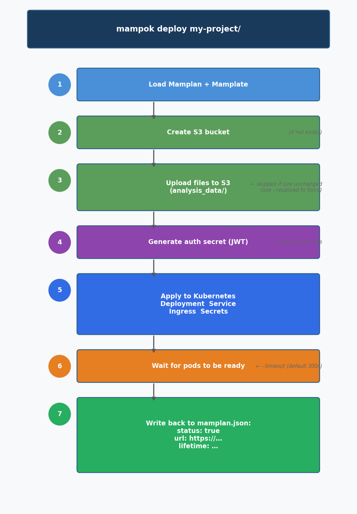

Getting Started
===============

This page walks you through installing Mampok and running your first deployment.

Requirements
------------

* **Python 3.11+**
* Access to a **Kubernetes cluster** (kubeconfig file required)
* An **S3-compatible object storage** endpoint (AWS S3, MinIO, Ceph, etc.)
* A **Mampok config file** (see :doc:`configuration`)

Installation
------------

From PyPI::

    pip install mampok

From source::

    git clone <repository>
    pip install ./mampok_v2

Verify the installation::

    mampok --help

Configuration
-------------

Before deploying anything, Mampok needs a configuration file at
``~/.mampok/config.json`` that specifies your cluster profiles, S3
credentials, and paths to your Mamplan and Mamplate repositories.

See :doc:`configuration` for the full reference. A minimal example::

    {
      "cluster": {
        "BN": {
          "host": "ingress.example.com",
          "namespace": "mampok",
          "kubeconfig_path": "/home/user/.kube/config",
          "ingress_class": "nginx"
        }
      },
      "s3": {
        "endpoint": "https://s3.example.com",
        "access_key": "my-key",
        "secret_key": "my-secret",
        "secretname": "s3-credentials",
        "prefix": "mampok"
      },
      "mamplan_repo": "/home/user/mamplans",
      "mamplates_path": "/home/user/mamplates",
      "lifetime_days": 30,
      "mampok_version": ">=2.0.0,<3.0.0"
    }

Your First Deployment
---------------------

**Step 1: Create a Mamplan**

A Mamplan is a JSON file that describes your project. The fastest way to
create one is with the :ref:`create-mamplan <cmd-create-mamplan>` command::

    mampok create-mamplan \
      --project-id my-cellxgene-project \
      --tool cellxgene \
      --cluster BN \
      --owner jdoe \
      --datatype scRNA-seq \
      --files data.h5ad \
      --output ~/mamplans/

This generates ``~/mamplans/my-cellxgene-project-mamplan.json``:

.. code-block:: json

    {
      "project": {
        "project_id": "my-cellxgene-project",
        "tool": "cellxgene",
        "files": ["data.h5ad"],
        "creation_date": "2026-03-26T12:00:00Z"
      },
      "deployment": {
        "cluster": "BN",
        "status": false,
        "auth": false,
        "bucket": "",
        "lifetime": "2026-03-26T12:00:00Z",
        "url": ""
      },
      "service": {
        "owner": "jdoe",
        "analyst": ["jdoe"],
        "datatype": ["scRNA-seq"],
        "download_allowed": false,
        "metadata": [],
        "organization": ["mpi-bn"],
        "user": ["jdoe"]
      }
    }

.. tip::

   You can also copy and edit a Mamplan by hand. See :doc:`mamplans` for a
   complete field reference.

**Step 2: Deploy**

::

    mampok deploy ~/mamplans/my-cellxgene-project-mamplan.json --config ~/.mampok/config.json

Mampok will show a confirmation table and then execute the deployment. When
it finishes, the Mamplan file is updated in-place with the URL and status:

.. code-block:: text

    The following 1 Mamplan(s) will be deployed:
      Project ID             Cluster       Owner         URL
      ─────────────────────────────────────────────────────
      my-cellxgene-project   BN            jdoe

    Continue? [y/N]: y

    Deployed: my-cellxgene-project
    URL: https://ingress.example.com/my-cellxgene-project

The URL is now also written back into the ``deployment.url`` field of your
Mamplan file.

What Happens During Deploy
--------------------------

   The seven steps Mampok executes when you run ``mampok deploy``.

1. **Load Mamplan + Mamplate** — Mampok reads the project file and the
   matching container template (e.g. ``cellxgene-mamplate.json``).
2. **Create S3 bucket** — If the bucket does not exist yet, it is created.
3. **Upload files** — Each file listed in ``project.files`` is uploaded to
   ``s3://bucket/analysis_data/``. Files are skipped if the S3 object already
   has the same size (use ``--reupload`` to force a fresh upload).
4. **Generate auth secret** — Only when ``deployment.auth: true``. A JWT
   secret and auth token URL are created.
5. **Apply Kubernetes resources** — A Deployment, Service, Ingress, and
   supporting Secrets are applied to the cluster.
6. **Wait for pod readiness** — Mampok polls until all pods are ready (default
   timeout: 300 seconds, configurable with ``--timeout``).
7. **Write back to Mamplan** — ``deployment.status`` is set to ``true``,
   ``deployment.url`` and ``deployment.lifetime`` are updated, and the file
   is saved to disk.

Next Steps
----------

* :doc:`concepts` — understand Mamplans, Mamplates, and how they interact
* :doc:`mamplans` — complete Mamplan field reference
* :doc:`commands` — all CLI commands with examples
* :doc:`configuration` — full config.json reference
