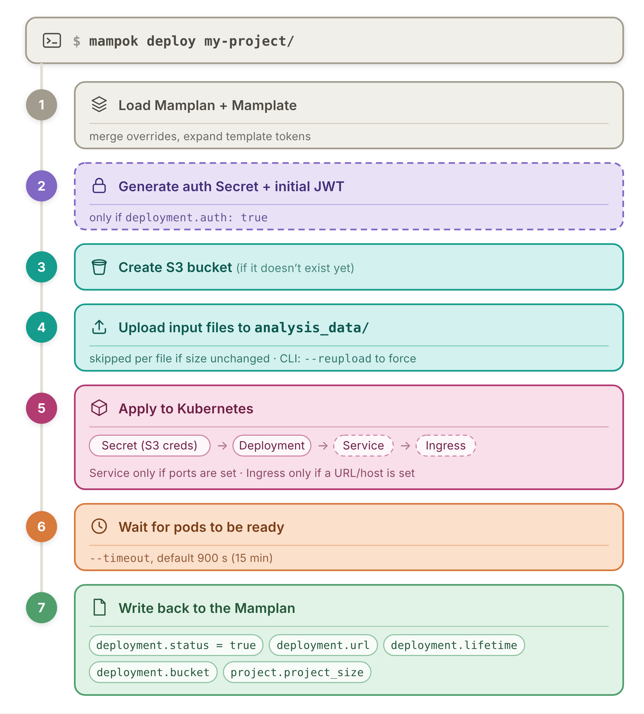

Getting Started
===============

This page walks you through installing Mampok and running your first deployment.

Requirements
------------

* **Python 3.11+**
* Access to a **Kubernetes cluster** (kubeconfig file required)
* An **S3-compatible object storage** endpoint (AWS S3, MinIO, Ceph, etc.)
* A **Mampok config file** (see :doc:`configuration`)

Installation
------------

From PyPI::

    pip install mampok

From source::

    git clone https://github.com/loosolab/MAMPOK
    cd MAMPOK
    pip install .

Verify the installation::

    mampok --help

Configuration
-------------

Before deploying anything, Mampok needs a configuration file that specifies
your cluster profiles, S3 credentials, and the path to your Mamplates
directory. (Mamplans have no repository path in the config: each command
takes a Mamplan file or directory directly as an argument.) The config path
must be passed explicitly to every command via ``--config``. There is no
default location.

See :doc:`configuration` for the full reference. A minimal example::

    {
      "cluster": {
        "MY_CLUSTER": {
          "host": "ingress.example.com",
          "namespace": "mampok",
          "kubeconfig_path": "/home/user/.kube/config",
          "ingress_class": "nginx"
        }
      },
      "s3": {
        "endpoint": "https://s3.example.com",
        "access_key": "my-key",
        "secret_key": "my-secret",
        "secretname": "s3-credentials",
        "prefix": "mampok"
      },
      "mamplates_path": "/home/user/mamplates",
      "lifetime_days": 30,
      "mampok_version": ">=2.0.0,<3.0.0"
    }

Your First Deployment
---------------------

**Step 1: Create a Mamplan**

A Mamplan is a JSON file that describes your project. The fastest way to
create one is with the :ref:`create-mamplan <cmd-create-mamplan>` command::

    mampok create-mamplan \
      --project-id my-cellxgene-project \
      --tool cellxgene \
      --cluster MY_CLUSTER \
      --owner jdoe \
      --datatype scRNA-seq \
      --files data.h5ad \
      --output ~/mamplans/ \
      --config ~/.mampok/config.json

This generates ``~/mamplans/my-cellxgene-project-mamplan.json``:

.. code-block:: json

    {
      "project": {
        "project_id": "my-cellxgene-project",
        "tool": "cellxgene",
        "files": ["data.h5ad"],
        "creation_date": "2026-03-26T12:00:00Z"
      },
      "deployment": {
        "cluster": "MY_CLUSTER",
        "status": false,
        "auth": false,
        "bucket": "",
        "lifetime": "2026-03-26T12:00:00Z",
        "url": "",
        "random_url_suffix": false
      },
      "service": {
        "owner": "jdoe",
        "analyst": ["jdoe"],
        "datatype": ["scRNA-seq"],
        "download_allowed": false,
        "metadata": [],
        "organization": [],
        "user": []
      }
    }

**Step 2: Deploy**

::

    mampok deploy ~/mamplans/my-cellxgene-project-mamplan.json --config ~/.mampok/config.json

Mampok will show a confirmation table and then execute the deployment. When
it finishes, the Mamplan file is updated in-place with the URL and status:

.. code-block:: text

    The following 1 Mamplan(s) will be deployed:
      Project ID            Cluster       Owner         URL                                               Path
      ------------------------------------------------------------------------------------------------------------------------------------
      my-cellxgene-project  MY_CLUSTER    jdoe                                                            ~/mamplans/my-cellxgene-project-mamplan.json

    Continue? [y/N]: y

    Deployed: my-cellxgene-project
    URL: https://ingress.example.com/mampok/my-cellxgene-project/cellxgene/

(The URL column is empty here because this project has never been deployed
before. It fills in on subsequent runs once ``deployment.url`` is set.)

The URL is now also written back into the ``deployment.url`` field of your
Mamplan file.

What Happens During Deploy
--------------------------

   The seven steps Mampok executes when you run ``mampok deploy``.

.. list-table::
   :header-rows: 1
   :widths: 30 70

   * - Step
     - Description
   * - 1. Load Mamplan + Mamplate
     - Mampok reads the project file and the matching container template
       (e.g. ``cellxgene-mamplate.json``), merges container overrides, and
       expands template tokens.
   * - 2. Generate auth secret
     - Only when ``deployment.auth: true``. A JWT secret and auth token URL
       are created before anything below, since pod startup fails without it.
   * - 3. Create S3 bucket
     - If the bucket does not exist yet, it is created.
   * - 4. Upload files
     - Each file listed in ``project.files`` is uploaded to
       ``s3://bucket/analysis_data/``. Files are skipped if the S3 object
       already has the same size. Use ``--reupload`` to force a fresh upload.
   * - 5. Apply Kubernetes resources
     - A Deployment and a Secret (S3 credentials) are always applied. A
       Service is added only if the tool exposes ports, and an Ingress only
       if a URL/host is configured.
   * - 6. Wait for pod readiness
     - Mampok polls until all pods are ready. Default timeout: 900 seconds,
       configurable with ``--timeout``.
   * - 7. Write back to Mamplan
     - ``deployment.status``, ``deployment.url``, ``deployment.lifetime``,
       and ``deployment.bucket`` are updated, along with
       ``project.project_size``, and the file is saved to disk.

Next Steps
----------

* :doc:`concepts`: understand Mamplans, Mamplates, and how they interact
* :doc:`mamplans`: complete Mamplan field reference
* :doc:`commands`: all CLI commands with examples
* :doc:`configuration`: full config.json reference
